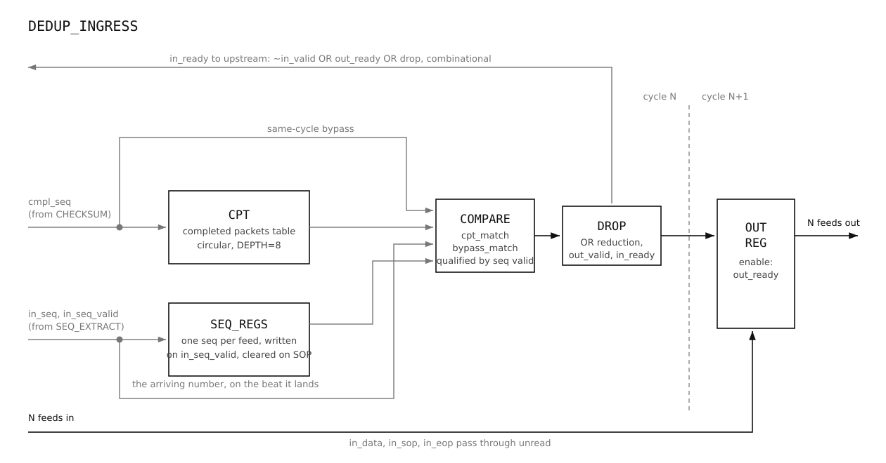

# dedup_ingress, Microarchitecture

## 1. Purpose and scope

This document describes the microarchitecture of `dedup_ingress`, the component within
the UDP market-data parser that drops redundant copies of packets already
confirmed downstream.

The system-level design document covers what this component does within the
parser and how it connects to the stages around it. This document goes one
level deeper: the internal structure, the key design decisions and the
reasoning behind them, the timing closure method and results, and the
verification approach used to validate it.

It is written for engineers reviewing or modifying this component directly:
readers who need to understand not just its behaviour at the interface, but why
the RTL is built the way it is.

The parser receives the same market data stream on several redundant feeds.
Every packet therefore arrives more than once, on different lines, at different
times. Only the first copy to get through is useful. Every later copy is dead
weight, and if it reaches the rest of the pipeline it wastes bandwidth in
`feed_buffer`, competes for the arbiter, and is checksummed for nothing.

DEDUP_INGRESS removes those copies. It sits at the front of the pipeline, between the
incoming feeds and `feed_buffer`, and it is the only block that knows a packet
has already been delivered.

A packet counts as delivered when CHECKSUM confirms it. That is the single
source of truth, and it is the only feedback DEDUP_INGRESS acts on. A copy whose
sequence number matches a confirmed packet is dropped. Everything else passes
through untouched.

DEDUP_INGRESS does not act on the arbiter's `invalidate_feed`. Invalidation means one
feed's copy was abandoned, not that the packet was delivered. If DEDUP_INGRESS dropped
that sequence number on every feed, a healthy copy on another line would be
discarded with it, and a packet that was still recoverable would be lost.
Invalidation stays scoped to the feed it happened on, and `feed_buffer` handles
it.

DEDUP_INGRESS does not reorder and does not buffer. It never stalls on its own account:
no internal condition, full table included, ever holds up a feed. It does pass
backpressure through, so when `out_ready` goes low on a feed, that feed's
`in_ready` follows and upstream is held off. It has no view of packet order or
gaps in the sequence. Detecting a missing packet belongs to FIX_TRACKER and
TIMER, not here.

## 2. Interface

### Parameters

| Parameter | Default | Meaning |
|---|---|---|
| `N_FEEDS` | 4 | Number of redundant feeds. Each has its own input and output port. |
| `DATA_W` | 64 | Datapath width in bits. |
| `SEQ_W` | 32 | Width of the sequence number field. |
| `SEQ_OFFSET` | 0 | Byte offset of the sequence number inside the first beat. |
| `CPT_DEPTH` | 8 | Number of completed packets held in the table. |

`SEQ_OFFSET` and `SEQ_W` exist because venues place the sequence number
differently. They must satisfy `SEQ_OFFSET*8 + SEQ_W <= DATA_W`, so the field
lands inside the first beat. A compile-time guard enforces this.

### Ports

| Port | Dir | Width | Meaning |
|---|---|---|---|
| `clk` | in | 1 | Clock. |
| `rst_n` | in | 1 | Active low asynchronous reset. |
| `in_valid` | in | `N_FEEDS` | Beat valid, per feed. |
| `in_ready` | out | `N_FEEDS` | Beat accepted, per feed. |
| `in_data` | in | `N_FEEDS` x `DATA_W` | Beat data, per feed. |
| `in_sop` | in | `N_FEEDS` | First beat of a packet, per feed. |
| `in_eop` | in | `N_FEEDS` | Last beat of a packet, per feed. |
| `out_valid` | out | `N_FEEDS` | Beat valid downstream, per feed. Low when the copy is dropped. |
| `out_ready` | in | `N_FEEDS` | Downstream has room, per feed. |
| `out_data` | out | `N_FEEDS` x `DATA_W` | Beat data, unchanged. |
| `out_sop` | out | `N_FEEDS` | First beat marker, unchanged. |
| `out_eop` | out | `N_FEEDS` | Last beat marker, unchanged. |
| `out_seq` | out | `N_FEEDS` x `SEQ_W` | Sequence number of the packet on that feed. |
| `cmpl_valid` | in | 1 | A packet has been confirmed by CHECKSUM. |
| `cmpl_seq` | in | `SEQ_W` | Sequence number of that packet. |

Each feed is an independent stream with its own handshake. There is no shared
port and no arbitration.

`out_seq` is produced so that no block downstream has to parse the header
again. `feed_buffer` needs it to know which held beats to flush when a
completion arrives.

### Environment assumption

`cmpl_valid` is not expected while a feed is blocked. If CHECKSUM cannot push
its output downstream it does not complete a packet, so it does not send
feedback. The RTL does not enforce this: a completion arriving while
`out_ready` is low would still be written to the table. This assumption holds
only while `out_ready` reaches CHECKSUM combinationally. If a register is ever
added to that path, it must be revisited.

## 3. Microarchitecture

DEDUP_INGRESS has three parts: sequence extraction with the per-feed context
registers, the completed packets table, and the comparator tree.



### Sequence extraction and `seq_regs`

The sequence number appears once, in the first beat of a packet. It is sliced
out combinationally at `SEQ_OFFSET` with width `SEQ_W`, giving
`seq_extract[f]`.

Later beats of the same packet carry no sequence number, so the value has to be
kept. `seq_regs[f]` holds the sequence number of the packet currently on feed
f. It is written when a SOP beat is accepted, that is when
`in_valid[f] && in_ready[f] && in_sop[f]`, and it holds until the next accepted
SOP on that feed.

The value used for comparison in a given cycle is `seq_sel[f]`. On an SOP beat
it is the freshly extracted value, because `seq_regs[f]` has not been written
yet. On every other beat it is `seq_regs[f]`.

```
seq_sel_valid[f] = in_valid[f];
seq_sel[f]       = in_sop[f] ? seq_extract[f] : seq_regs[f];
```

`seq_sel_valid[f]` is simply `in_valid[f]`. A feed with no beat this cycle has
nothing to compare, whatever its register happens to hold.

### Completed packets table

The CPT holds the sequence numbers of the last `CPT_DEPTH` confirmed packets.
It has three pieces of state: `cpt_seq`, the sequence numbers, `cpt_occupied`,
one bit per entry, and `cpt_wr_ptr`, the write pointer.

A completion always writes. The pointer advances and wraps at `CPT_DEPTH`, so
the oldest entry is overwritten once the table is full. There is no full
condition, and nothing waits.

### Comparator tree

The tree runs every cycle. For each feed, `seq_sel[f]` is compared against
every occupied CPT entry and against `cmpl_seq` if a completion is arriving
this cycle.

```
cpt_match[f][e] = cpt_occupied[e] && (cpt_seq[e] == seq_sel[f]);
bypass_match[f] = cmpl_valid && (cmpl_seq == seq_sel[f]);
drop[f]         = seq_sel_valid[f] && (|cpt_match[f] || bypass_match[f]);
```

The second term is the same-cycle bypass. A completion is not readable in the
table until the next cycle, so without it a copy arriving in the same cycle as
its own completion would pass through.

This is the widest logic in the block: `N_FEEDS * (CPT_DEPTH + 1)` equality
comparisons of `SEQ_W` bits each, all in parallel. Each feed's comparisons are
independent of every other feed's.

## 4. Behaviour

### Zero latency datapath

There is no register between input and output. `out_data`, `out_sop` and
`out_eop` are the input signals, unchanged. `out_seq` is `seq_sel`. A beat
presented on `in_data[f]` appears on `out_data[f]` in the same cycle.

The only thing DEDUP_INGRESS does to the stream is withhold `out_valid[f]` when that
feed's copy is being dropped:

```
out_valid[f] = in_valid[f] && !drop[f];
```

The registers in the block, `seq_regs`, `cpt_seq`, `cpt_occupied` and
`cpt_wr_ptr`, hold state. None of them is in the datapath.

### The drop decision

A copy is dropped when its sequence number matches a packet already confirmed
by CHECKSUM. The match is against the table, or against a completion arriving
in the same cycle.

A drop is not a special output state. Downstream sees `out_valid[f]` low, which
is the same as an idle feed. The beat is discarded and nothing marks it.

### Same-cycle bypass

The CPT write happens on the clock edge, so a completion arriving in cycle N is
only readable in the table from cycle N+1. Without the bypass, a copy arriving
in cycle N alongside its own completion would be forwarded, and only the copies
from N+1 onwards would be dropped.

The bypass compares `seq_sel[f]` against `cmpl_seq` directly, so the drop takes
effect in the same cycle the completion arrives.

### Mid packet kill

The comparison runs on every beat, not only on SOP. So a packet can be killed
part way through.

For example, feed 0 is streaming packet 100. Beats 1 and 2 pass through and
land in `feed_buffer`. On beat 3, another feed's copy of packet 100 completes.
From that cycle `seq_sel[0]` matches, so beat 3 and everything after it is
dropped.

That leaves beats 1 and 2 sitting in `feed_buffer` with no EOP coming.
`feed_buffer` flushes them using the same completion feedback.

The arbiter cannot do this. `invalidate_feed` only fires for the feed the
arbiter is serving. Here it may never have selected feed 0 at all.

### Flow control

`in_ready[f] = out_ready[f]`, per feed, combinational.

A dropped beat never reaches `feed_buffer`, so it never uses a FIFO slot. The
drop makes no difference to how much room is downstream, so `in_ready` does not
look at it.

## 5. Design decisions

### Completions, not invalidation

DEDUP_INGRESS acts only on CHECKSUM completions. It ignores the arbiter's
`invalidate_feed`.

Invalidation means one feed's copy was abandoned. It does not mean the packet
was delivered. If DEDUP_INGRESS dropped that sequence number everywhere, a healthy copy
on another feed would be discarded with it, and a packet that could still have
been served would be lost.

A completion is the only signal that says a packet is truly finished.

### Evict oldest, not age out

Two policies were considered for removing entries from the CPT: overwrite the
oldest when a new completion arrives, or hold each entry for a fixed number of
cycles and then clear it.

Both answer the same question, how long a completed sequence number stays
protected. Evict-oldest measures that in completions, the timer measures it in
cycles. Completions is the better unit, because what matters is how many
packets can go by before a late copy shows up, and that is a packet count. It
is also cheaper: no counter per entry.

Removing an entry when the packet's EOP is seen was also considered and
rejected. Later copies arrive on other feeds after that point, which is the
whole reason the entry exists.

### No stalling on a full table

The table never signals full and never holds anything up. A completion always
writes.

Backpressuring CHECKSUM because a bookkeeping table is full would push
backpressure the wrong way through the pipeline and would stall the output path
for no useful reason.

The cost is that a late copy whose sequence number has been evicted passes
through. That is accepted, see section 7.

### No skid buffer

A skid buffer is needed when a beat can arrive that cannot be taken. That
happens when `out_ready` is registered, because upstream then acts on stale
information and commits a beat that has nowhere to go.

Here `out_ready` is combinational and `in_ready` follows it in the same cycle.
Upstream never commits a beat DEDUP_INGRESS cannot take, so there is nothing to absorb.

If a register is ever added to the ready path, this has to be revisited.

### CPT_DEPTH of 8, parameterised

The depth sets how long a completed sequence number stays protected. What it
needs to cover is the gap between the first and last copy of the same packet
arriving on different feeds.

Deeper is safer against late copies but costs timing, since the comparator tree
grows as `N_FEEDS * (CPT_DEPTH + 1)`. 8 is the starting point. The parameter is
there so the depth can be swept against STA.

## 6. Timing

Synthesised for Xilinx Kintex-7 `xc7k160tffg676-3` at 325 MHz, a 3.077 ns
period.

### Measuring a block with no registers in the datapath

DEDUP_INGRESS's datapath runs from input port to output port with nothing in between. A
standalone synthesis therefore contains no register to register path through
the comparator tree, and STA has nothing to time. Running it that way reports
only the CPT bookkeeping, which is a handful of logic and always passes. The
number is real but it does not describe the block.

The alternative is to constrain the ports with `set_input_delay` and
`set_output_delay`. That works, but it measures the block against a budget
chosen by hand, so the answer depends on the numbers picked.

The method used here is `sta/dedup_ingress_sta_harness.sv`. It instantiates `dedup_ingress` and
puts a register on every input and every output. The combinational datapath
becomes a real register to register path, so STA measures the logic depth of
the block itself with no assumed budget. The flops belong to the measurement,
not to the design, and the harness is not part of the pipeline.

### Result

WNS +0.513 ns post synthesis.

Worst path:

```
Source:       in_data_q_reg[0][3]/C
Destination:  out_valid_reg[0]/D
Data Path Delay: 2.425 ns  (logic 0.971 ns, route 1.454 ns)
Logic Levels: 7  (CARRY4=3, LUT3=1, LUT4=1, LUT5=1, LUT6=1)
```

The path runs from an input data bit, through sequence extraction, through the
comparator tree, through the drop decision, to `out_valid`. This is the path
predicted to be critical, and it is. The three CARRY4s are the equality
comparators, which Vivado maps onto the carry chain rather than LUTs.

### If depth grows

The margin is 0.513 ns on a 3.077 ns period. Raising `CPT_DEPTH` widens the
tree and eats into it.

If it stops closing, the cut goes between the comparators and the OR reduction,
which costs one cycle of latency through the block. It does not go into the
ready path: `in_ready` must stay independent of the tree.

## 7. Verification

21 tests under `verification/`, run with cocotb against Verilator:

```
cd verification && make
```

### Golden model

`dedup_ingress_common.py` holds a cycle accurate model of the block: the CPT, the write
pointer, and the per feed sequence registers. Every cycle it is given the same
stimulus as the DUT and predicts `out_valid`, `in_ready` and `out_seq`. The
driver compares them on every cycle of every test, directed and random alike,
so a directed test only has to set up its scenario and assert the one thing it
is about.

### Directed coverage

**Passthrough.** An empty table, and a populated table holding sequence numbers
that never match, both leave every beat untouched. Four packets in flight on
four feeds at once also pass.

**Drop.** A completed packet's later copy is dropped, on one feed and on all
feeds at once.

**Same-cycle bypass.** A copy arriving in the very cycle its completion arrives
is dropped, and the entry then persists into the table from the next cycle.

**Both paths together.** One feed matching a table entry and another matching
the live completion in the same cycle, with a third feed matching neither and
surviving.

**Table.** A completion is written whether or not it matched anything that
cycle. The write pointer advances cleanly across a full table. One completion
past full evicts the oldest entry, and everything newer is still held.

**Late copy.** A copy whose sequence number has been evicted passes through.
Asserted as intended behaviour, so a future change to the eviction policy has
to be deliberate.

**Mid packet kill.** A feed streaming a packet that completes elsewhere is cut
off from that cycle on. Its next packet is unaffected, and a second feed
carrying a different packet is untouched.

**Flow control.** `in_ready` follows `out_ready` per feed. It does not move when
a copy is dropped. Stalling one feed leaves the others streaming. A SOP
presented while ready is low does not update that feed's `seq_regs`.

### Constrained random

Two regimes, both checked against the golden model every cycle.

The first uses a 64 value sequence pool, so duplicates are occasional and most
traffic passes. It checks the block over 3000 cycles of normal traffic.

The second uses a pool of 6, so nearly everything collides and the table stays
saturated. It hammers the comparator and the eviction path, which the first
barely touches.

Both apply independent per feed backpressure and keep SOP and EOP coherent per
feed.

### What this block cannot catch

The table only remembers the last 8 completed packets. If a copy arrives very
late, after 8 more packets have completed, its sequence number is gone from the
table and the copy passes through.

This is expected. It comes from the fixed table size. Test 9 checks it, so if
the table ever changes, someone has to change that test on purpose.
