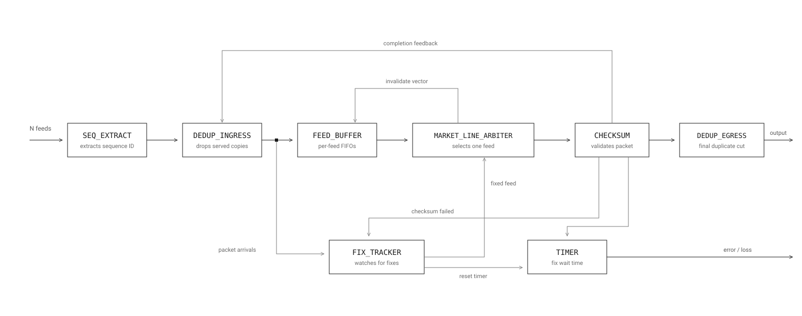

UDP Market-Data Parser, Design Overview

1. Purpose and scope

This document describes the architecture of a UDP market-data parser implemented on FPGA. It covers the parser as a whole: the design goals that shape it, the pipeline structure, the interface conventions its stages share, and the current implementation status of each stage.

The parser is under active development. Individual components are designed, implemented, and verified independently before integration, and each has its own documentation covering its internal microarchitecture in detail. This document stays at the system level and does not duplicate that per-component detail.

This design covers the transport layer: taking packets off redundant UDP feeds, removing duplicates, arbitrating between lines, and validating them. Decoding the exchange specific message format carried inside the payload is a separate concern and sits downstream of this pipeline.

It is written for engineers evaluating or working with the design: readers who want to understand what the parser is intended to do, how its stages fit together, and where the project currently stands.

2. Context

Exchanges distribute market data over UDP, typically as multiple redundant feeds. The same logical stream is published on several lines so that a receiver can tolerate loss on any one of them: if a packet is dropped or delayed on one feed, the same packet is expected to arrive on another.

In practice these feeds are not synchronised. Packets arrive at different times on different lines, the ordering between feeds is unpredictable, and the content can diverge for short periods when one feed falls behind or loses data. A receiver therefore cannot assume the lines are identical or aligned, and cannot simply select one and ignore the rest.

This shapes the parser in two ways. First, the design cannot depend on a single feed: it must select between them and be able to abandon one that stops delivering mid-packet. Second, that selection is held for the duration of a packet, since interleaving beats from different feeds would corrupt the output. The choice is therefore made per packet rather than per cycle, and is broken early only when the selected feed stalls beyond a threshold.

Because market data is latency-sensitive, both of these have to happen without deep buffering or pipeline stalls. The cost of waiting is measured in cycles.

3. Design goals

Deterministic, low-latency handling. Every stage is designed for fixed, predictable cycle behaviour rather than best-effort throughput. Data moves through the pipeline without deep buffering, and the path from input to output is short enough to reason about in cycles.

Frequency target. The design targets 325 MHz on a Xilinx Kintex-7. This is set high deliberately: it forces short combinational paths and shallow logic depth at every stage, which keeps per-stage latency low and leaves headroom for the pipeline to grow without renegotiating timing.

No loss under backpressure. Downstream stalls must never cause a beat to be dropped or duplicated. Each stage absorbs backpressure locally and propagates readiness upstream, so a stall degrades throughput but never correctness.

No loss on unselected feeds. A feed that is not currently being served must not lose data. Incoming beats are captured and held, and readiness is signalled back to the source so it knows when to hold off, ensuring that a feed passed over by arbitration can still be served correctly later.

Packet integrity. Packet boundaries are preserved end to end. Once a packet begins, its beats are delivered in order and without interleaving from another source.

Modularity and independent verification. Stages communicate through a common handshake and beat format, so each can be developed, verified, and timing-closed on its own before integration. This keeps verification tractable and makes it possible to reason about a stage in isolation.

Parameterisation. Feed count, data and sequence widths, and timing thresholds are parameters rather than hard-coded constants, so the design can be retargeted without structural change.

4. Pipeline architecture

The parser is organised as a chain of independent stages, each with a single responsibility. Data flows left to right through the main path, with two satellite blocks handling retry logic and a feedback path closing the loop back to the front of the pipeline.

Stages

DEDUP sits at the head of the pipeline. Because the feeds are redundant copies of the same stream arriving at unpredictable times, the same packet will appear on other feeds after it has already been served. DEDUP drops those late duplicates so a packet that has already been forwarded successfully does not enter the pipeline a second time. It is also where the sequence number is extracted: the field arrives only in the first beat of a packet, so DEDUP slices it out, holds it for the rest of the packet, and presents it alongside every beat it forwards.

FEED_BUFFER provides per-feed FIFO storage. The arbiter serves one feed at a time, so without buffering here the unselected feeds would immediately backpressure their sources. The FIFOs absorb incoming traffic while a feed waits its turn, and backpressure only propagates upstream when a FIFO genuinely fills.

The buffer is bypassed when it is not needed. If a feed's FIFO is empty and the arbiter is ready to accept, the data is forwarded straight through rather than written and read back, saving a cycle on the common path. This applies independently to every feed, so all feeds that can be forwarded are forwarded. Buffering begins as soon as the arbiter stops accepting, and once a FIFO holds data it keeps draining in order until empty, so ordering is never mixed between the bypass and stored paths.

FEED_BUFFER makes no selection decisions and has no knowledge of why the arbiter is or is not ready. It sees only readiness on its output, presents what it holds, and lets the arbiter choose.

Two inputs let the buffer discard data it no longer needs to hold. The arbiter drives an invalidate vector, one bit per feed, when it gives up on a stalled feed mid-packet: the buffer then clears that feed's remaining beats so the abandoned packet's tail is never forwarded as a fragment. Separately, the completion feedback from CHECKSUM tells the buffer which packets have already been served successfully, so it can drop copies of those packets still sitting in the other feeds' FIFOs.

Latency through this stage is a range rather than a fixed number: minimum on the bypass path, and bounded above by FIFO depth and how long a feed waits to be served.

MARKET_LINE_ARBITER picks which feed goes downstream, keeps that choice for the whole packet, and gives up on a feed that goes quiet in the middle of a packet for a parameterisable number of cycles. When it gives up, it sends an invalidate vector to FEED_BUFFER, one bit per feed, telling it to clear what is left of that packet so the leftover part is never sent on as a fragment.

CHECKSUM validates the served packet. Its result is the definition of success for the pipeline: a packet is only complete once its checksum passes, which is why the completion feedback originates here rather than at the arbiter.

Satellite logic

FIX_TRACKER keeps track of packets whose checksum failed. CHECKSUM tells it which packet went bad, and from then on it watches the stream coming out of DEDUP for a fresh copy of that packet. As soon as a copy arrives on any feed, it tells the arbiter to prefer that feed.

It does not wait for the new copy to be validated first. Waiting for CHECKSUM to confirm the replacement would add a full round trip before the arbiter is even told the packet is available, so FIX_TRACKER acts on arrival instead. If the replacement also fails its checksum, CHECKSUM reports the failure again and FIX_TRACKER simply starts watching for the next copy. The process repeats until a good copy gets through or the timer runs out.

TIMER starts counting when a checksum fails. It gives the pipeline a set number of cycles to receive a good copy of that packet. If no good copy arrives in time, the timer stops waiting and an error is reported downstream. The number of cycles is a parameter.

Completion feedback runs from CHECKSUM back to DEDUP and FEED_BUFFER. It tells them a packet has been served successfully. DEDUP uses it to drop later copies of that packet, and FEED_BUFFER uses it to release copies it is still holding.

Number of feeds

The design takes the feed count as a parameter, so it is not tied to a fixed number. In practice the number stays small.

Exchanges publish market data as redundant multicast lines, usually two identical copies called the A and B feeds, sent over separate network paths so that a packet lost on one can be recovered from the other [7]. This A/B arrangement is the norm across venues such as NYSE Pillar, Nasdaq and OTC Markets. A receiver taking both lines from two sites ends up with four feeds, which is the realistic upper end.

Larger counts do not appear in practice, because the redundancy comes from having a few independent paths, not from having many copies. The design therefore targets up to four feeds, while keeping the count parameterisable.

Pipeline register placement

The stages are split by what they do, not by how many cycles they take. Whether a register goes between two stages is decided later, from static timing analysis.

If two stages can run in the same cycle and still meet the target frequency, they share a cycle and save latency. If they can't, a register goes between them. At 325 MHz there isn't much time in a cycle, so merging two stages that both do real work is often not possible.

The same applies inside a stage. If one stage has too much logic to finish in a single cycle, it is split into more than one cycle. How many cycles each stage takes is decided when the design is implemented and timed, not before.

5. Related work

The problem this parser solves is a known one, and its overall shape follows established practice rather than inventing it. Redundant lines merged into a single stream, duplicate removal keyed on the packet sequence number, a bounded budget before abandoning a line that has gone quiet, and a datapath that forwards first and corrects afterwards: all four appear in published FPGA feed handlers and in the exchange specifications themselves.

Exchange documentation defines the receiver side directly. CME Group publishes its recommended practice for MDP 3.0: listen to both Incremental Feed A and Feed B, process packets by sequence number, and discard a packet whose sequence number has already been processed [7]. The sequence number sits in the transport header rather than the payload, with MoldUDP64 placing it in a fixed 20 byte downstream packet header [8], which is what makes a transport-layer parser possible at all.

On the hardware side, Denholm et al. [1] is the closest published work. They build an A/B line arbitrator on a Xilinx Virtex-6 and evaluate it against NASDAQ TotalView-ITCH, OPRA and ARCA. Their block produces two outputs at once: a low latency mode that forwards a packet in a single cycle without waiting for anything missing, and a high reliability mode that buffers out-of-order packets and stalls the output until the gap fills or a window expires, measured at 7 cycles for packets that did not need buffering. Earlier work from the same group [2] and from Morris et al. [3] covers FPGA feed processing more generally. Lockwood et al. [4] present an FPGA IP library for high-frequency trading including protocol parsers, and Pottathuparambil et al. [5] and Leber et al. [6] build feed handlers for specific message formats. Notably, [1] observes that most of these feed processors omit A/B line arbitration altogether, or describe it without implementing it.

How this design relates

Several structural choices here match that work, having been arrived at independently.

The sequence number field is parameterised by width and byte offset. [1] identifies the same three facts as the minimum needed to retarget an arbitrator between protocols: maximum packet size, sequence number width, and byte position of the sequence number. Their own targets vary widely on the last two, which is why this design carries them as parameters with a compile-time guard rather than fixing them.

Sequence number comparison is the critical path. [1] reports the same, and measures a wider sequence number costing measurably more time. This design sees it in the same place: the worst path in DEDUP runs from the input data through the comparator tree to the output valid, which is why the table depth is a parameter to be swept against static timing analysis rather than chosen up front.

Forward first, correct later. The low latency mode in [1] emits a packet before its sequence number has been checked, then discards it once the check fails. Both DEDUP and MARKET_LINE_ARBITER work this way. DEDUP withholds output valid the moment a packet's sequence number matches a completed one, which can happen mid-packet; MARKET_LINE_ARBITER raises its invalidate vector after it has already forwarded part of a packet from a feed it then gives up on. In both cases a downstream stage clears the fragment.

The same principle holds at the tail of the pipeline. Beats of the selected packet are passed downstream as they are served, before CHECKSUM has finished computing over the whole packet. Validation therefore confirms a packet that has already left rather than gating its departure, and a failure is handled after the fact by FIX_TRACKER and TIMER. Nothing in the datapath waits for the checksum, which is why the completion feedback is a confirmation and not a permission.

A cycle budget before giving up. The threshold in MARKET_LINE_ARBITER for abandoning a silent feed is the same construct [1] uses to decide how long to hold the output waiting for a missing packet.

A bounded window sized in packets, not cycles. DEDUP's table of completed packets overwrites its oldest entry rather than expiring entries on a timer. [1] gives the same reasoning for preferring count-based windowing to time-based windowing: a count tracks the real rate of incoming data, which varies through the trading day, where a fixed timeout does not. The consequence, that a copy arriving after the window has moved on is not recognised as a duplicate, is common to every windowed arbitrator.

Two decisions differ, and are made on their own merits.

Duplicate detection is driven by downstream confirmation, not by a watermark. [1] treats a packet as a duplicate when its sequence number is at or below the next expected one. That is a single comparison and never misses a duplicate, but it assumes ordered arrival, so a genuinely out-of-order packet is discarded as though it were a copy. It is the reason their high reliability mode needs a reordering buffer.

This design instead holds a bounded table of recently completed sequence numbers and compares against all of them in parallel. It costs more comparators and can miss a very late copy, but an out-of-order packet passes through untouched with no buffer and no stall. More significantly, the table is written by the completion feedback from CHECKSUM, not by what the pipeline has forwarded. Forwarding a copy is not the same as delivering it: a copy that fails its checksum was worthless, and a copy abandoned mid-packet by the arbiter was never delivered at all. Only a passing checksum confirms a packet is finished, which is why DEDUP acts on completion feedback and deliberately ignores the arbiter's invalidate vector.

Feeds stay independent until the arbiter. Published designs merge into a single stream at the front. Here every feed remains its own stream with its own handshake through DEDUP, and they converge only at MARKET_LINE_ARBITER. This is what allows DEDUP to pass readiness straight through per feed with no skid buffer and no contention, so no feed can head-of-line block another. The cost is one output port and one set of comparators per feed.

Scope

This parser implements the low latency path only. It does not reorder, does not buffer to wait for a missing packet, and never stalls the datapath on a sequence gap.

That is deliberate. The high reliability path in [1] exists for consumers that need a complete ordered stream, such as book builders and risk systems. For a trading decision, data recovered by that wait has usually gone stale, so the latency is paid on every packet to recover something no longer worth having. Gap handling here is pushed out to FIX_TRACKER and TIMER, which observe the stream and report a missing packet downstream without ever holding up the datapath.

6. Interfaces

All stages talk to each other the same way, so any stage can be connected to the next without special glue logic.

Handshake. Each connection uses a valid/ready pair. The sender raises valid when it has data. The receiver raises ready when it can accept. A beat moves on a clock edge only when both are high. A receiver that cannot accept lowers ready, and the sender holds its data steady until the beat is taken. This is what lets backpressure travel upstream without anything being lost.

Beat format. A packet is carried as one or more beats. Each beat carries the payload and two boundary markers: start of packet and end of packet. A single beat packet has both markers set.

Sequence number. The sequence number is not repeated on every beat. It arrives once, inside the payload of the first beat, at a byte offset and width fixed by the exchange protocol. DEDUP slices it out there, holds it for the remaining beats of that packet, and re-emits it on a separate signal alongside every beat it forwards. Stages after DEDUP therefore see the sequence number on every beat without parsing the header again. It identifies which packet a beat belongs to, and is what DEDUP and FIX_TRACKER use to match copies of the same packet across different feeds.

Per feed signalling. Stages that handle several feeds at once carry the handshake per feed rather than for the group. A feed that is blocked does not stop the others, and readiness is reported back to each feed independently.

Widths. Payload width, sequence number width and byte offset, and feed count are parameters. Stages are written against those parameters rather than fixed sizes, so the pipeline can be retargeted without changing the logic.

7. Verification approach

Each component is verified on its own before it is integrated. A stage is only considered done when it passes its own test suite and closes timing, so problems are found in the smallest possible context rather than after everything is wired together.

Per component. Verification uses cocotb with Verilator. Each stage has two layers of testing. Directed tests cover specific behaviours: normal operation, boundary cases, backpressure, and error handling. A constrained random test then drives the stage with randomised traffic and checks every output on every cycle against an independent golden model written in Python.

Parameter sweeps. Because thresholds and widths are parameters, the suites are run across a range of values rather than a single configuration. A design that works at one setting and breaks at another is not correct, and sweeping catches that.

The feed count is currently only exercised at four. That reflects what is realistic in practice, since exchanges publish a small number of redundant lines, but it is a gap in coverage rather than a proof of correctness. Claiming the design is properly parameterisable in feed count means running the suites at other values as well, for example one, two, three, five and eight. That work is outstanding.

Integration. Once several stages exist, they will be verified together end to end: full packets driven in at the feeds and checked at the output, including duplicate handling, feed dropout, and recovery. This layer is not built yet.

8. Future work

Remaining stages. CHECKSUM, FIX_TRACKER and TIMER are specified but not implemented. Each will be built the same way as the stages already done: designed, verified against a golden model, and timing closed on its own before integration. End to end verification of the assembled pipeline follows after that.

Feed count coverage. The verification suites currently run at four feeds. Running them across other values is needed before the design can be called parameterisable in feed count.

Higher throughput. The current target is 325 MHz on a 64-bit datapath, which is the conventional arrangement for 10G line rate: 64 bits at 156.25 MHz gives 10 Gbps [1]. Production market data parsers run considerably faster, with figures around 644 MHz on a narrower 16-bit datapath used to sustain the same line rate. Reaching that would mean rebalancing the pipeline for a much shorter cycle, which is a redesign rather than an optimisation.

Message format decode. The parser handles the transport layer only. Decoding exchange message formats such as ITCH, SBE and FIX/FAST sits downstream and is not covered here.

9. References

[1] S. Denholm, H. Inoue, T. Takenaka, T. Becker and W. Luk, "Low Latency FPGA Acceleration of Market Data Feed Arbitration," IEEE ASAP 2014, pp. 36-40. https://www.doc.ic.ac.uk/~wl/papers/14/asap14sd.pdf

[2] S. Denholm, H. Inoue, T. Takenaka and W. Luk, "Application-specific customisation of market data feed arbitration," IEEE FPT 2013, pp. 322-325.

[3] G. Morris, D. Thomas and W. Luk, "FPGA Accelerated Low-Latency Market Data Feed Processing," IEEE HOTI 2009.

[4] J. W. Lockwood, A. Gupte, N. Mehta, M. Blott, T. English and K. Vissers, "A Low-Latency Library in FPGA Hardware for High-Frequency Trading (HFT)," IEEE HOTI 2012, pp. 9-16.

[5] R. Pottathuparambil, J. Coyne, J. Allred, W. Lynch and V. Natoli, "Low-Latency FPGA Based Financial Data Feed Handler," IEEE FCCM 2011, pp. 93-96.

[6] C. Leber, B. Geib and H. Litz, "High Frequency Trading Acceleration Using FPGAs," IEEE FPL 2011, pp. 317-322.

[7] CME Group, "MDP 3.0 Incremental Feed Arbitration." https://www.cmegroup.com/confluence/display/EPICSANDBOX/MDP+3.0+-+Incremental+Feed+Arbitration

[8] Nasdaq, "MoldUDP64 Protocol Specification v1.00," 2009. https://www.nasdaqtrader.com/content/technicalsupport/specifications/dataproducts/moldudp64.pdf
