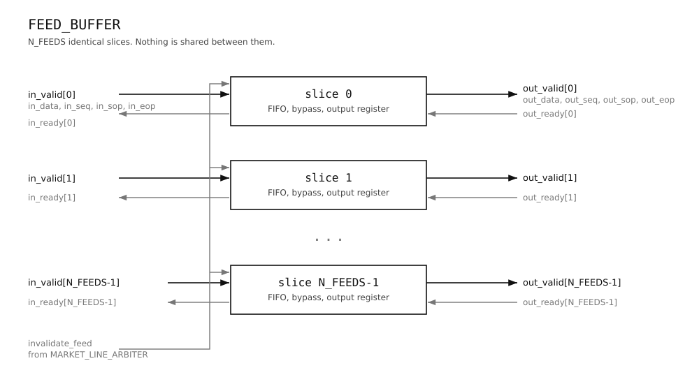
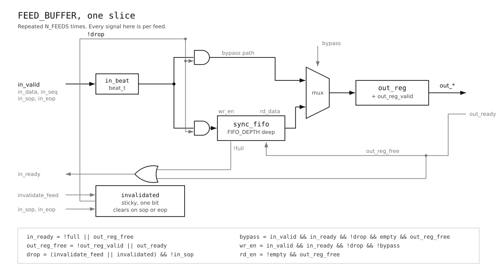

# feed_buffer, design document

## 1. Purpose and scope

`feed_buffer` holds per feed FIFO storage between `dedup_ingress` and
`market_line_arbiter`.

The arbiter serves one feed at a time and holds that choice for a whole packet.
Without storage in front of it, every feed it is not serving would immediately
backpressure its source. The block absorbs that traffic so a feed waiting its
turn keeps accepting data, and so no feed can block another.

It is storage and flow control. Nothing else. It makes no selection decisions
and does not look at packet contents. It takes two things from the arbiter:
readiness on its output, and `invalidate_feed`, one bit per feed, raised when
the arbiter gives up on a stalled feed. Readiness says when to present the next
beat. Invalidate says to drop that feed's incoming beats until the abandoned
packet is over. Neither tells it anything else about what the arbiter is doing.

Each feed gets its own FIFO. They are plain single clock FIFOs with a read side
and a write side, and nothing is shared between them. A bypass path lets a beat
skip the FIFO when it is empty and the output is free, so the common case does
not pay for a write and a read it does not need.

Latency through the block is a range, not a fixed number. A beat arriving to an
empty FIFO with the output register free is presented one cycle later. A beat
that has to be stored waits for the FIFO ahead of it to drain and for the
arbiter to serve that feed.



## 2. Interface

### Parameters

| Parameter | Default | Meaning |
|---|---|---|
| `N_FEEDS` | 4 | Number of input feeds. One FIFO, one bypass path and one output register per feed. |
| `DATA_W` | 64 | Payload width in bits. |
| `SEQ_W` | 32 | Sequence number width in bits. |
| `FIFO_DEPTH` | 32 | Entries per feed FIFO. Must be a power of two. |

`FIFO_DEPTH` must be a power of two because `sync_fifo` derives full and empty
from an extra pointer bit rather than a counter. A compile time guard checks it,
alongside `N_FEEDS` being at least one and `FIFO_DEPTH` at least two.

### Ports

| Port | Direction | Width | Meaning |
|---|---|---|---|
| `clk` | in | 1 | |
| `rst_n` | in | 1 | Active low, asynchronous. |
| `in_valid` | in | `N_FEEDS` | Per feed. |
| `in_ready` | out | `N_FEEDS` | Per feed. |
| `in_data` | in | `N_FEEDS` x `DATA_W` | |
| `in_seq` | in | `N_FEEDS` x `SEQ_W` | |
| `in_sop` | in | `N_FEEDS` | Start of packet. |
| `in_eop` | in | `N_FEEDS` | End of packet. |
| `out_valid` | out | `N_FEEDS` | Per feed. |
| `out_ready` | in | `N_FEEDS` | Per feed, from the arbiter. |
| `out_data` | out | `N_FEEDS` x `DATA_W` | |
| `out_seq` | out | `N_FEEDS` x `SEQ_W` | |
| `out_sop` | out | `N_FEEDS` | |
| `out_eop` | out | `N_FEEDS` | |
| `invalidate_feed` | in | `N_FEEDS` | From the arbiter, one bit per feed. |

### Handshake

Standard valid and ready. A beat moves on a clock edge when both are high.
Every feed has its own pair on both sides, so a feed that is blocked does not
stop the others.

`in_ready` is high when that feed's FIFO has room, or when the feed is
draining. A full FIFO does not hold off its source as long as a beat is leaving
on the same edge. `out_ready` from the arbiter reaches `in_ready` through that
second term. Section 5 covers why.

### Beat format

A beat carries the payload, the sequence number, `sop` and `eop`. A single beat
packet has both `sop` and `eop` set. The sequence number is present on every
beat, having been extracted from the first beat's payload by `dedup_ingress`
and re-emitted per beat, so this block does not parse anything.

### `invalidate_feed`

One bit per feed. It says the arbiter has given up on that feed. It carries no
sequence number, because it does not need to: the block drops that feed's
incoming beats until it sees `eop` or `sop`, whichever comes first. Section 4
covers the rule.

## 3. Microarchitecture

The block is `N_FEEDS` identical slices built by a generate loop. Each slice has
its own FIFO, bypass path, output register and invalidate bit. Nothing is shared
between them except the clock and reset, which is what keeps feeds independent.



`in_beat` is the four input fields packed into one value. It goes two places:
the FIFO write port, and the bypass leg of the mux. Only one of the two is taken
in any cycle.

### `beat_t`

The four fields are packed into a struct so the FIFO stores one value rather
than four:

```systemverilog
typedef struct packed {
    logic [DATA_W-1:0] data;
    logic [SEQ_W-1:0]  seq;
    logic              sop;
    logic              eop;
} beat_t;
```

At the defaults that is 98 bits. The width is taken as `$bits(beat_t)` rather
than written out, so adding a field cannot leave the FIFO width behind.

The struct is declared inside `feed_buffer` and does not leave it. The ports
either side are flat, so `dedup_ingress` and `market_line_arbiter` need to know
nothing about it, and neither had to change to accommodate it.

### `sync_fifo`

A separate module, instantiated once per feed. Generic: a width, a depth, a
write port, a read port. It knows nothing about beats or feeds. It exposes
`full` and `empty`.

`rd_data` is combinational, so when `empty` is low the head is already visible
that cycle. That is what makes the stored path two cycles rather than three.

The storage is an array indexed by a register, so Vivado maps it to distributed
RAM. At the defaults that is 98 bits by 32 entries by 4 feeds.

There is no flush port. Section 5 covers why none is needed.

### Output register

One per feed. Both the bypass and the FIFO head feed it. It holds a beat until
the arbiter takes it, and `out_valid` is simply its valid bit.

`out_reg_free` is the condition that lets a new beat in:

```systemverilog
assign out_reg_free = !out_reg_valid[f] || out_ready[f];
```

Free means it holds nothing, or the arbiter is taking what it holds this cycle.
It is not the same as `out_ready` being high, and section 4 shows why the
difference is worth a cycle.

## 4. Behaviour

### The bypass path

A beat arriving to an empty FIFO with the output register free skips the FIFO
entirely. It is captured in the output register at the end of that cycle and
presented on the next one.

```
cycle 0   in_valid, FIFO empty, out_reg_free
cycle 1   out_valid, beat presented
```

### The stored path

If the beat cannot bypass, it is written to the FIFO. It is presented once it
reaches the head and the output register is free.

```
cycle 0   in_valid, beat written to the FIFO
cycle 1   beat at the head, rd_data shows it, read into out_reg
cycle 2   out_valid, beat presented
```

Two cycles rather than one. That single cycle is what the bypass buys, on every
beat that takes it.

### Why `fifo_empty` is in the bypass condition

A beat must never overtake one already queued. If the FIFO holds anything, the
arriving beat is written behind it, even if the output register happens to be
free that cycle. Once the FIFO has drained back to empty, the bypass resumes.

### Backpressure downstream

The output register holds its contents while `out_ready` is low. `out_valid`
stays high and the beat does not change. The FIFO does not advance its read
pointer, because `rd_en` is qualified with `out_reg_free`.

Beats arriving during the stall go into the FIFO, since the register is
occupied.

### Backpressure upstream

`in_ready[f]` is `!fifo_full || out_reg_free`. Section 5 covers the second term.

Capacity per feed is `FIFO_DEPTH + 1` beats: the FIFO plus the one held in the
output register.

### The sticky invalidate

`invalidate_feed` says the arbiter has given up on that feed. The arbiter only
does this after the feed has gone silent, which happens only once its FIFO has
run empty. So there is never anything stored to throw away. What has to be
discarded is the tail of the abandoned packet, still arriving.

`drop` is combinational, so a beat arriving in the same cycle as
`invalidate_feed` is already dropped:

```systemverilog
assign drop = (invalidate_feed[f] || invalidated[f]) && !in_sop[f];
```

Only `in_sop` appears here. `in_eop` does not, and the difference matters. The
`eop` beat is the last beat of the abandoned packet, so it has to be dropped
like the rest of the tail. The `sop` beat belongs to a new packet, so it has to
be kept.

`in_eop` appears instead in the clear:

```systemverilog
end else if (in_valid[f] && in_ready[f] && (in_sop[f] || in_eop[f])) begin
    invalidated[f] <= 1'b0;
```

So an `eop` beat is dropped in its own cycle and clears the bit for the next
one. A `sop` beat clears the bit and is accepted in the same cycle. A single
beat packet carries both and is accepted.

The bit clears on whichever of the two arrives first.

A dropped beat is not written to the FIFO and does not bypass. It also does not
affect `in_ready`, so the upstream handshake completes normally and the beat
simply goes nowhere.

## 5. Design decisions

### `in_ready` allows a beat in while one is leaving

```systemverilog
assign in_ready[f] = !fifo_full || out_reg_free;
```

Occupancy alone is not enough. With the FIFO full and the output register
occupied, the cycle the arbiter takes a beat the FIFO pops, but `full` is
computed from the pointers as they stood and does not clear until the next
cycle. A beat arriving in between is refused for no reason.

The second term removes that. `out_reg_free` means the register can take a beat
this cycle: either it holds nothing, or the arbiter is taking what it holds.
When the second is true the whole feed shifts along by one, so a beat can come
in on the same edge that one leaves.

`sync_fifo` does not qualify its write with `full`, which is what makes this
legal. Its contract is stated in its header: the caller must not assert `wr_en`
on a full FIFO unless it is also reading. `feed_buffer` satisfies that, because
when `full` is high both `in_ready` and `fifo_rd_en` reduce to `out_reg_free`.

Measured cost of the second term: 0.009 ns. Section 6 has the numbers.

### The output is registered

Both the bypass and the FIFO head feed one register per feed. That keeps
`out_ready` out of everything except the one term above.

A beat therefore cannot be presented in the cycle it arrives. Under a streaming
load that costs nothing, since beats arrive one after another and the register
is presenting the previous one.

### `out_reg_free` is not `out_ready`

An empty register can take a beat even while the arbiter is stalled. Using
`out_ready` alone would leave the register unused during a stall, sending the
beat to the FIFO instead of into a slot that was sitting empty.

### No flush port on the FIFO

`invalidate_feed` never needs to clear stored beats.

The arbiter gives up on a feed only after it has gone silent for
`HICCUP_CYCLES`, and a feed goes silent only when its FIFO has run empty. So the
FIFO is empty when the invalidate arrives, by construction. What has to be
discarded is the tail still on its way in, and the sticky bit stops those at the
write side.

### The beat is a struct, and it stays local

Packing the four fields into `beat_t` means the FIFO stores and returns one
value. The width is `$bits(beat_t)`, so adding a field cannot leave the FIFO
behind.

The struct is declared inside `feed_buffer`. The ports either side are flat, so
`dedup_ingress` and `market_line_arbiter` did not have to change, and neither
has to know the type exists.

### `sync_fifo` is a separate module

It is generic and knows nothing about feeds or beats, so it can be verified on
its own. That matters here: most of what can go wrong in this block is FIFO
behaviour at its boundaries, and finding those failures against a small
standalone module is easier than finding them through four instances wrapped in
bypass logic.

### The EOP clear condition is defensive

Under well formed traffic it is redundant. The beat after a dropped `eop` is
always a `sop`, which clears the bit anyway, so removing `eop` from the clear
changes nothing observable, and the verification suite cannot tell the two
apart.

It is kept because the bit should clear on whichever comes first. Waiting only
for a `sop` means a feed that goes quiet after its tail stays marked for as long
as the silence lasts.

## 6. Timing

Synthesised for Xilinx Kintex-7 `xc7k160tffg676-3` at 325 MHz, a 3.077 ns
period.

**WNS +0.688 ns** post synthesis.

```
Source:       g_feed[3].u_fifo/wr_ptr_reg[1]/C
Destination:  g_feed[3].u_fifo/mem_reg_0_31_0_5/RAMA/WE
Data Path Delay: 1.920 ns  (logic 0.431 ns, route 1.489 ns)
```

The path runs from a FIFO write pointer bit, through the comparison that
produces `full`, through `in_ready` and the bypass decision, to the FIFO write
enable. Which feed it lands on is placement, not structure: all `N_FEEDS` slices
are identical and any of them can be the worst.

Only 0.431 ns is logic. The other 1.489 ns is routing into the distributed RAM,
which is where the block spends most of its budget.

Adding `out_reg_free` to `in_ready`, which is what removes the bubble described
in section 5, cost 0.009 ns. The logic delay did not move at all: the extra term
folded into LUTs that were already on the path. Before the change the same path
measured +0.697 ns with 1.911 ns of delay.

Reproduce with:

```bash
cd sta && vivado -mode batch -source run.tcl
```

### What `FIFO_DEPTH` costs

Depth sets the pointer width, so doubling it adds a bit to the comparison that
produces `full`, which sits on the worst path. It also grows the distributed
RAM, which is where the routing delay already goes.

At depth 32 there is 0.688 ns of margin, so there is room. The thing to watch is
not the logic but the RAM: past a certain size Vivado moves the storage into
block RAM, and block RAM has a registered read port. That would break the
combinational `rd_data` this design depends on, and the read path would cost an
extra cycle.

## 7. Verification

Two suites, both cocotb against Verilator. `sync_fifo` is generic, so it is
verified on its own before `feed_buffer` is built on top of it.

```bash
cd verification && make                  # feed_buffer
cd verification && make -f Makefile.fifo # sync_fifo
```

### The golden model

`feed_buffer_common.py` holds a cycle accurate model of one slice: a FIFO, an
output register with a valid bit, a sticky invalidate bit, and the bypass.

The testbench checks `in_ready`, `out_valid`, and every output field against the
model on every cycle of every test, directed and random alike. That means the
directed tests only have to create the situation worth checking. They do not
assert the outputs themselves.

A beat counts as taken when `out_valid` and `out_ready` are both high, so a beat
held across a stall is recorded once rather than every cycle it sits in the
register.

### `sync_fifo`

- Empty at reset. `full` asserts at exactly `DEPTH` entries and not before.
- `rd_data` shows the head in the same cycle `empty` goes low. This is what
  makes the read path one cycle rather than two, so it is asserted rather than
  assumed.
- A read from an empty FIFO is refused without moving the read pointer.
- A write and a read together on a full FIFO are both accepted. Occupancy stays
  at `DEPTH`, the beat leaving is the old head and is not corrupted by the beat
  arriving, and order holds across the drain afterwards.
- Read and write together at occupancy 1, 2 and `DEPTH-1`.
- Wrap: fill, drain, fill again past the wrap point, order preserved.
- Random traffic in three regimes against a deque, holding to the module's
  contract that a write into a full FIFO is only offered alongside a read.

### `feed_buffer`

**Passthrough.** Single beat and multi beat packets arrive intact and in order,
four feeds at once, and back to back packets keep their boundaries.

**Bypass.** A bypassed beat is presented exactly one cycle later, on every feed.
A beat bypasses into an empty output register even while the arbiter is stalled.
A beat does not bypass when the register is occupied, or when the FIFO is not
empty. These use latency at the port rather than reaching inside the block,
since latency is what the bypass exists for and what a change to it would break.

**Backpressure.** A held beat is stable and taken exactly once. A full feed does
not block the others, drains without losing or reordering a beat, and a beat
offered while genuinely blocked is not quietly accepted. A full feed still
accepts a beat on the cycle the arbiter takes one, which is the bubble section 5
describes, and sustained one in one out runs for sixteen straight cycles without
losing or reordering anything.

**Invalidate.** The drop is same cycle, sticky, and scoped to one feed. It
clears on `eop`, with that beat dropped, and on `sop`, with that beat accepted.
Invalidate fires on a silent feed and a tail arriving much later still dies. Two
feeds invalidated at once do not disturb the others.

**Constrained random.** Four regimes: light backpressure where the bypass
carries almost everything, heavy backpressure where the FIFOs fill and
`in_ready` starts falling, invalidate firing often against a background of
stalls, and single beat packets only, which is where a FIFO holds the most
distinct packets at once.

### Mutation testing

The suite is mutation checked: the RTL is broken deliberately, one change at a
time, to confirm the tests fail. A test that passes against a broken design is
not testing anything.

Against 29 `feed_buffer` tests and 8 `sync_fifo` tests:

| Mutation | `feed_buffer` failed | `sync_fifo` failed |
|---|---|---|
| `out_reg_free` is just `out_ready` | 14 | 0 |
| Bypass ignores `fifo_empty` | 13 | 0 |
| FIFO read ignores `out_reg_free` | 12 | 0 |
| `in_ready` loses the `out_reg_free` term | 7 | 0 |
| Drop ignores the sticky bit | 5 | 0 |
| `sync_fifo` refuses a write when full | 5 | 2 |
| Drop ignores `in_sop`, so a `sop` is not accepted | 4 | 0 |
| Drop has no same cycle path | 3 | 0 |
| Sticky clears only on `eop`, so a `sop` never clears it | 2 | 0 |
| Sticky clears only on `sop`, so an `eop` never clears it | 0 | 0 |

The last one is not a coverage gap. Removing the `eop` condition changes nothing
observable, because the beat after a dropped `eop` is always a `sop`, which
clears the bit at the same moment. Section 5 explains why the condition is kept
anyway.
