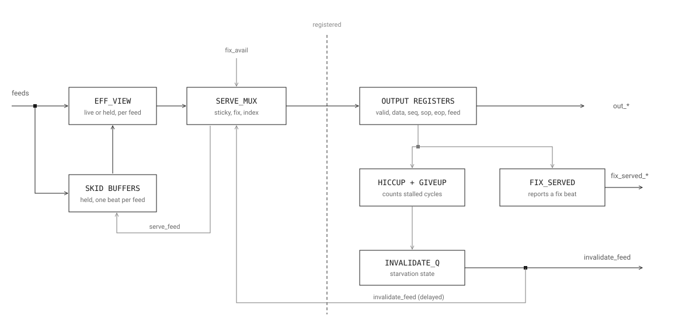
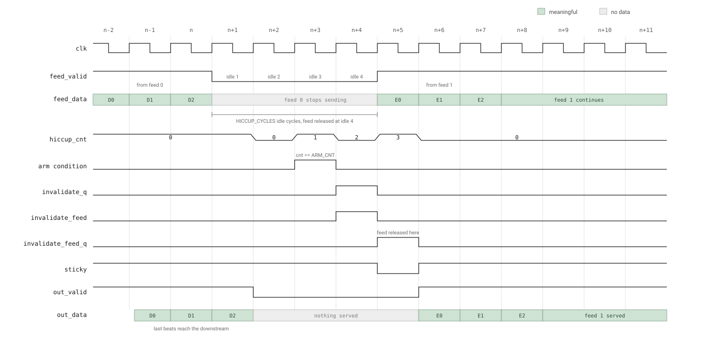

# market_line_arbiter, Microarchitecture

## 1. Purpose and scope

This document describes the microarchitecture of `market_line_arbiter`, the component within the UDP market-data parser that selects among redundant input feeds and serves their packets downstream atomically.

The system-level design document covers what this component does within the parser and how it connects to the stages around it. This document goes one level deeper: the internal pipeline structure, the key design decisions and the reasoning behind them, the starvation and recovery mechanism, timing closure results, and the verification approach used to validate it.

Timing-sensitive behaviour is described cycle accurately. Where a sequence of events matters, such as arming, confirming, and releasing during starvation, each step is given its exact cycle number rather than a general description, so the mechanism can be checked directly against the RTL or a waveform.

It is written for engineers reviewing or modifying this component directly: readers who need to understand not just its behaviour at the interface, but why the RTL is built the way it is.

## 2. Interface

All ports are synchronous to `clk` and reset by the active-low `rst_n`.

### Parameters

| Parameter | Default | Description |
|---|---|---|
| `NUM_FEEDS` | 4 | Number of input feeds. |
| `FEED_ID_W` | `$clog2(NUM_FEEDS)` | Width of the feed index carried on `out_feed` / `fix_served_feed`. |
| `HICCUP_CYCLES` | 4 | Silent cycles before the arbiter gives up on a feed. Must be at least 3. |
| `HICCUP_W` | `$clog2(HICCUP_CYCLES)` | Width of the internal hiccup counter. |
| `SEQ_W` | 32 | Width of the sequence number field. |
| `DATA_W` | 64 | Width of the payload field. |

### Per-feed inputs

| Port | Width | Description |
|---|---|---|
| `feed_valid` | `NUM_FEEDS` | One valid bit per feed. |
| `feed_sop` | `NUM_FEEDS` | Start-of-packet marker per feed. |
| `feed_eop` | `NUM_FEEDS` | End-of-packet marker per feed. |
| `feed_data` | `NUM_FEEDS` x `DATA_W` | Payload per feed. |
| `feed_seq` | `NUM_FEEDS` x `SEQ_W` | Sequence number per feed. |
| `fix_avail` | `NUM_FEEDS` | Set by FIX_TRACKER to mark which feed currently carries a preferred, corrected packet. |

### Per-feed outputs

| Port | Width | Description |
|---|---|---|
| `in_ready` | `NUM_FEEDS` | Backpressure to each feed; combinational. |
| `invalidate_feed` | `NUM_FEEDS` | One-shot pulse marking a feed the arbiter has given up on, sent to FEED_BUFFER so it can discard the abandoned packet's remainder. |

### Downstream interface

| Port | Width | Description |
|---|---|---|
| `out_ready` | 1 | Backpressure from downstream (CHECKSUM). |
| `out_valid` | 1 | Registered output valid. |
| `out_data` | `DATA_W` | Registered output payload. |
| `out_seq` | `SEQ_W` | Registered output sequence number. |
| `out_sop` / `out_eop` | 1 each | Registered packet boundary markers. |
| `out_feed` | `FEED_ID_W` | Index of the feed the current output beat came from. |

### Fix reporting

| Port | Width | Description |
|---|---|---|
| `fix_served_feed` | `FEED_ID_W` | Same value as `out_feed`, valid when the served beat came from a fix. |
| `fix_served_valid` | 1 | High when the currently served beat is a fix. |

## 3. Microarchitecture

The RTL is organised into two stages. Stage 1 covers the combinational selection logic and the skid buffers. Stage 2 covers the registered output and the starvation tracking, plus a few extra registers of its own.



### Stage 1: selection

Each feed has a small **skid buffer**, one beat deep. Its job is to hold a beat that arrived but could not be taken this cycle, so nothing is lost when the arbiter is busy with another feed or downstream stalls. `eff_valid`, `eff_data` and the rest are the *effective view* of each feed: whatever is sitting in that feed's skid buffer if it holds something, otherwise whatever is arriving live this cycle.

**Feed selection (`serve_mux`)** picks one feed to serve, based on three things in order:

1. **Sticky.** If a feed is already selected and its packet has not reached its last beat, and it has not just been given up on, the same feed is kept. This is what keeps a packet from being interleaved with another feed's data.
2. **Fix preference.** If sticky does not hold, the lowest-indexed feed with `fix_avail` set wins.
3. **Lowest index with data.** If neither of the above applies, the lowest-indexed feed with valid data wins.

Once a feed is picked, its data, sequence number and boundary markers are read out through an **OR-reduction mux** rather than a priority chain: each feed's value is masked by whether it was selected and the results are OR'd together. Because exactly one feed is ever selected, this gives the same result as a priority chain but in a shallower gate depth, which matters directly for timing closure at 325 MHz.

**Skid buffer update.** A feed's skid buffer fills when a beat arrives but is not immediately served, and drains when its held beat is served and a new beat arrives to take its place, or clears once served with nothing new behind it. This is what allows unselected feeds to keep accepting data without the arbiter needing to look at them.

**`in_ready`** is fully combinational: a feed is ready to accept new data whenever its skid buffer is empty, or it is empty because it is being served and downstream is ready this very cycle. There is no registered readiness anywhere in this path, which keeps backpressure propagation to a single cycle.

Everything decided in Stage 1, which feed was picked, its data and boundary markers, whether a real transfer happened, is registered into Stage 2 on the next clock edge.

### Stage 2: output and starvation tracking

Stage 2 holds the registered output (`out_valid`, `out_data`, `out_seq`, `out_sop`, `out_eop`, `out_feed`), and separately tracks how long the currently selected feed has gone silent. That tracking is what drives the starvation and recovery mechanism, covered cycle by cycle in the next section.

### Why invalidation lives in FEED_BUFFER, not here

An earlier version of the arbiter tried to handle a stalled feed entirely by itself, with its own state machine tracking whether that feed was mid-packet. That ran into a real problem: whether the arbiter should stay locked onto the feed, and whether it should recognise the feed as dead, ended up depending on each other. Neither could be decided cleanly without the other one already being known.

The fix was to stop trying to solve this inside the arbiter. Now the arbiter only decides one thing: when to give up on a feed. It signals that decision once, with the `invalidate_feed` pulse, and lets FEED_BUFFER deal with the actual leftover data. That removed the circular dependency entirely, because the arbiter no longer needs to track packet state to make its decision.

### Why `serve_feed_q` resets to all zero, not to feed 0

Resetting to a specific one-hot value (say, feed 0 selected) would make the very first cycle after reset behave as if feed 0 were already sticky, before it has ever actually served anything. Resetting to all-zero means sticky is false on the first cycle regardless of feed count, and the real priority order runs from the first live cycle onward.

## 4. Starvation handling

### The counter

`hiccup_cnt` counts how many cycles the selected feed has gone silent. It advances only when `out_ready` is high, so a downstream stall never counts toward giving up. It clears when the feed delivers a beat, and it clears when a giveup is confirmed.

### How a giveup propagates

Giving up is not a single event. The decision has to travel through two registers before it can take effect, and that is what sets the timing of everything else.

When `hiccup_cnt` reaches `ARM_CNT`, the arm condition is true and `invalidate_q_nxt` is loaded with the feed being given up on. Nothing is visible outside the block yet.

One cycle later `invalidate_q` is set. `invalidate_feed` is driven combinationally from it, so the pulse leaves the block on this cycle, provided the feed is still silent (`!serve_valid_c`) and downstream is ready.

One cycle after that, `invalidate_feed_q` holds the record of the pulse. `sticky` reads `invalidate_feed_q`, not the live `invalidate_feed`, so this is the first cycle on which the feed can actually be released.

Three cycles, therefore: one to detect, one for `invalidate_q` to become visible and fire the pulse, one for `invalidate_feed_q` to release sticky. `ARM_CNT = HICCUP_CYCLES - 3` places the arm point exactly far enough back that the pulse lands at `hiccup_cnt == HICCUP_CYCLES - 1`.

The one-cycle gap between arming and firing is also what lets a late beat cancel the giveup. If the feed delivers on the firing cycle, `serve_valid_c` is high, `invalidate_feed` never fires, and the feed carries on. The further one-cycle delay before release is what allows beats already in flight to reach the output before the feed is dropped.

### Why `HICCUP_CYCLES` cannot be below 3

With `HICCUP_CYCLES = 1`, `ARM_CNT` evaluates to `-2`, which is not a value the counter can ever hold. The arm condition would never be true. Structurally the same thing is being said: a threshold of one leaves no cycles for the decision to pass through `invalidate_q` and `invalidate_feed_q`, so the pulse cannot possibly be produced within the threshold it is supposed to respect. `HICCUP_CYCLES = 2` fails for the same reason with one cycle of shortfall instead of two.

Both values are rejected at compile time rather than allowed to behave incorrectly.

Intuitively they would be poor choices anyway. Declaring a feed dead after a single quiet cycle defeats the purpose of tolerating short gaps, which is the reason the mechanism exists. Three is the structural minimum, and arguably still aggressive in practice, but it is the point below which the design cannot function at all.

### The boundary at 3

At `HICCUP_CYCLES = 3`, `ARM_CNT` is 0, which is also the counter's reset value. The arm comparison is therefore true whenever the counter sits at zero, including immediately after a successful transfer clears it. This is why the arm condition carries `&& !serve_valid_q`: without it, the arbiter armed during the first valid beat of a packet and produced two invalidate pulses instead of one. The gate restricts arming to genuine silence.

### Walkthrough



The waveform shows the full sequence at `HICCUP_CYCLES = 4`. The mechanism is identical at other values; only the counter climb is longer.

**Cycles n-2 to n.** Feed 0 is selected and delivering. Beats D0, D1, D2 arrive on `feed_data` with `feed_valid` high, and appear on `out_data` one cycle later. `hiccup_cnt` sits at 0, and nothing in the control group is active.

**Cycle n+1.** Feed 0 stops sending. `feed_valid` goes low and stays low. This is the first idle cycle.

**Cycles n+1 to n+2.** The last beats already inside the arbiter continue to the output. `out_valid` stays high for one more cycle after the input goes quiet, which is D2 being served. After that the output goes idle. `hiccup_cnt` begins climbing.

**Cycle n+3.** `hiccup_cnt` reaches `ARM_CNT`. The arm condition is true for this one cycle, and `invalidate_q_nxt` is loaded. Nothing is visible outside the block yet.

**Cycle n+4.** `invalidate_q` is now set. Because the feed is still silent and downstream is ready, `invalidate_feed` fires as a single-cycle pulse. FEED_BUFFER receives it here and discards what remains of the abandoned packet.

**Cycle n+5.** `invalidate_feed_q` holds the record of that pulse. `sticky` drops, and feed 0 is released. This is the fourth idle cycle, which is why the threshold is expressed as `HICCUP_CYCLES`.

**Cycle n+5 onward.** Feed 1 has data waiting, so the arbiter picks it immediately. `feed_valid` rises again with E0, `sticky` reasserts as the arbiter commits to feed 1's packet, and E0, E1, E2 flow to the output one cycle behind the input. `hiccup_cnt` is back at 0 and the control signals are idle again.

The important detail is the gap between the pulse and the release. `invalidate_feed` fires one cycle before `sticky` drops, because `sticky` reads `invalidate_feed_q` rather than the live signal. That extra cycle is what lets the last in-flight beats reach the output before the feed is dropped.

## 5. Timing closure

### Setup

STA was run in Vivado 2025.2.1, synthesis only, no `opt_design`, `place_design`, or `route_design`. Target part is a Kintex-7, `xc7k160tffg676-3`, speed grade -3. The clock constraint is a 3.077 ns period, 325 MHz.

This part was chosen because it was the device family available in the toolchain.

### Result

All constraints are met. Worst negative slack on setup is +0.298 ns across 514 endpoints, 0 failing. Worst hold slack is +0.090 ns, also 0 failing. Pulse width checks pass with +1.188 ns of margin.

### Worst path

The five worst setup paths in the report are the same logical path repeated across different bit positions of the same destination register, all at +0.298 ns slack:

- Source: `skid_valid_reg[0]/C`, feed 0's skid buffer valid bit.
- Destination: `skid_data_reg[1][*]/CE`, the clock enable on feed 1's skid data register.
- 4 logic levels: LUT4 x1, LUT5 x1, LUT6 x2.
- Data path delay 2.407 ns: 0.474 ns logic, 1.933 ns routing.

Routing is 80% of the delay because nothing is placed yet. A post-route run will move this number, in either direction, placement and `phys_opt_design` can recover some of it, real routing can also add more.

The path sits at the interaction between the `in_ready` computation and skid buffer control described in section 3: feed 0 going valid feeds into shared readiness logic that, several LUT levels later, reaches the clock enable on feed 1's skid register. The individual net names in the report (`in_ready_OBUF[3]_inst_i_7` and similar) are synthesis-internal and don't map one-to-one back to RTL signal names, so this description stops at what the report actually supports.

### Resource utilization

444 Slice LUTs (0.44% of the device), 510 Slice Registers (0.25%). 0 Block RAM, 0 DSP. The design is small relative to the device; the timing result is not resource-constrained.

### Caveats on these numbers

Two things limit how far this result can be trusted:

Bonded IOB usage is reported at 515 against 400 available on this package, 128.75% over. That only shows up because this run synthesizes the arbiter standalone, with every port at the chip boundary. Inside the full parser it isn't a top-level module, its ports become internal nets to DEDUP_INGRESS, FEED_BUFFER, and CHECKSUM, and the constraint disappears. It does mean this exact device and package cannot host the arbiter as a true standalone top, so what's reported here is a synthesis-only timing and resource check, not a claim that this configuration places and routes as shown.

These are post-synthesis numbers, not post-route. Placement and routing will move them, so this result is a check on the RTL's structure rather than a final figure.

## 6. Verification

### Approach

The component is verified in simulation with cocotb driving Verilator. Tests are Python, the DUT is wrapped in a thin SystemVerilog wrapper (`market_line_arbiter_tb_wrap.sv`) that flattens the packed array ports so cocotb can drive them per feed.

Two layers: directed tests that target specific mechanisms, and a random test checked against a golden model. The full suite is 32 tests, all passing.

### Directed tests

Six files, each covering one area:

| File | Covers |
|---|---|
| `test_mainstream.py` | Normal traffic, packet atomicity, feed handoff at EOP. |
| `test_backpressure.py` | `out_ready` deassertion, skid buffer fill and drain, counter freeze during stalls. |
| `test_fix.py` | `fix_avail` preference, `fix_served_valid` and `fix_served_feed` reporting. |
| `test_hiccup.py` | The arm, confirm, release sequence and the `invalidate_feed` pulse. |
| `test_fix_hiccup.py` | Fix preference interacting with a giveup in progress. |
| `test_hiccup_threshold.py` | Behaviour at and around the `HICCUP_CYCLES` boundary. |

Shared helpers live in `arb_common.py`.

### Random test

`test_random.py` drives 3000 cycles of randomised traffic, with random valid patterns, packet lengths, `fix_avail` assertions, and `out_ready` backpressure. Every output beat is compared against a Python golden model that reimplements the arbiter's behaviour independently of the RTL. Zero mismatches.

The golden model is not a rewrite of the RTL in Python. It was built from the behavioural rules established during directed-test debugging, so a shared misunderstanding between the two would have to be a misunderstanding of the specification, not of the code.

### Parameter sweep

`HICCUP_CYCLES` is swept through the Makefile:

```
make HICCUP_CYCLES=N
```

The full suite passes at 3, 4, 8, 13, and 16. Three is the structural minimum, enforced by a compile-time `$error` guard as described in section 4. Sixteen is an arbitrary upper point, chosen to exercise a long counter without the sweep taking excessive time.

The value 3 is the important one, since it is the boundary where `ARM_CNT` collides with the counter's reset value. That case found a real bug, the double-arm described in section 4, which the sweep caught and which values above 3 do not expose.

### What the tests establish

Packets are never interleaved between feeds. No beat is lost or duplicated under backpressure. The giveup sequence produces exactly one `invalidate_feed` pulse per abandoned packet, at the correct cycle. A late beat arriving on the firing cycle cancels the giveup. The behaviour holds across the swept `HICCUP_CYCLES` values.

## 7. Known limitations and future work

### Limitations

**Only verified at four feeds.** `NUM_FEEDS` is a parameter, but the entire test suite runs at 4. The RTL is written generically and nothing in it assumes a specific feed count, but that is untested. Higher feed counts would also deepen the selection logic, so the timing result in section 5 should not be assumed to hold as the count grows.

**No mid-stream reset test.** All tests reset once at the start and run to completion. Asserting `rst_n` in the middle of a packet, with skid buffers holding data and a giveup in progress, is not covered.

**`HICCUP_CYCLES` cannot go below 3.** This is structural, explained in section 4, and enforced at compile time. It means the arbiter cannot be configured to give up faster than three silent cycles.

**Timing is post-synthesis only.** Section 5's numbers come from synthesis, not place and route. Routing this component in isolation, with all its ports forced to chip pins, would not produce a number that means anything about the final design, so it is deferred until the surrounding parser stages exist. The IOB overflow noted in section 5 is the same fact seen from another angle.

### Future work

Feed count and mid-stream reset are the two verification gaps worth closing next, since both are testable against the RTL as it stands.

Throughput and format-handling goals are set at the parser level rather than here, and are covered in the top-level design document.
