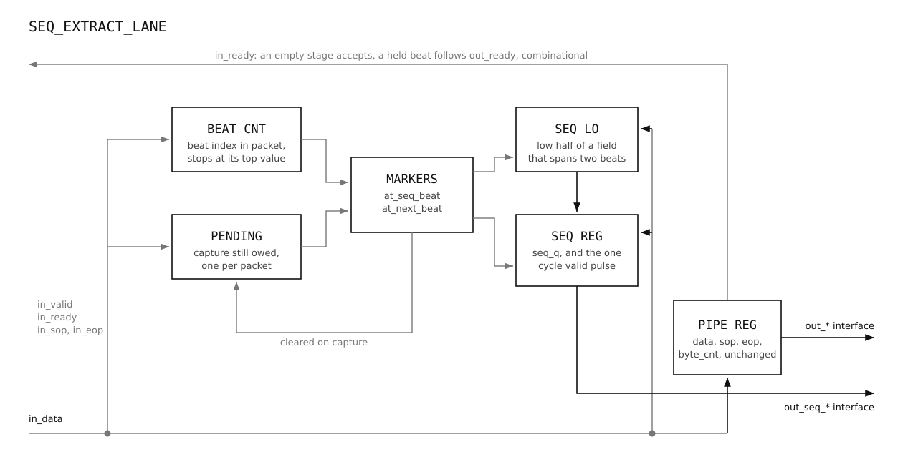

# seq_extract Microarchitecture Specification

## 1. Purpose and scope

This document describes the microarchitecture of `seq_extract`, the component at
the front of the UDP market-data parser that pulls the sequence ID out of each
feed's beat stream.

The system-level design document covers what this component does within the
parser and how it connects to the stages around it. This document goes one
level deeper: the internal structure, the key design decisions and the
reasoning behind them, the timing closure method and results, and the
verification approach used to validate it.

Every packet carries a sequence ID at a fixed byte offset from its start. Every
stage behind this one needs that number: `dedup_ingress` compares it against the
completed packets table, `dedup_egress` makes the final drop decision with it,
and the stages in between carry it along. Extracting it once, at the front,
means no block downstream has to parse a header.

The sequence ID does not live in the first beat. The MAC strips the Ethernet
header and nothing else, so a beat stream starts at the IP header: 20 bytes of
IP, then 8 of UDP, then the exchange's own header at byte 28. The sequence ID
sits somewhere inside that, at an offset the venue decides. At 64 bits per beat
it therefore lands in beat 3 or later, and depending on the offset it may sit
inside one beat or cross into the next. Both cases are handled, chosen at
elaboration time.

SEQ_EXTRACT does not compare, drop, buffer or reorder. It passes every beat
through a single register stage unchanged and adds two outputs: the extracted
sequence ID and a one cycle valid that marks the beat which completed it. A
packet that ends before the sequence ID is complete produces no valid at all.

It never originates a stall. Every stall it applies comes from downstream: when
`out_ready` goes low on a feed that is holding a beat, that feed's `in_ready`
follows and upstream is held off. A feed holding nothing accepts regardless.

Feeds are independent. There is no shared state, no arbitration and no path
between lanes.

## 2. Interface

`seq_extract` is a wrapper. It holds no logic of its own: it instantiates
`N_FEEDS` copies of `seq_extract_lane` and wires feed f's ports to lane f. Both
modules are documented here, the wrapper first.

### Parameters

| Parameter | Default | Meaning |
|---|---|---|
| `N_FEEDS` | 4 | Number of redundant feeds. Each has its own lane, input and output port. |
| `DATA_W` | 64 | Datapath width in bits. |
| `SEQ_W` | 32 | Width of the sequence ID. |
| `SEQ_OFFSET` | 0 | Byte offset of the sequence ID from the start of a packet. |

`SEQ_OFFSET` and `SEQ_W` exist because venues place the sequence ID
differently. The offset may put it in any beat, and may split it across two.

The byte count width is not a parameter. It is fixed by `DATA_W`, so exposing it
would let a caller set a value that does not match the datapath. The ports
declare it as `$clog2(DATA_W/8)` directly, and the wrapper passes that value
down to each lane as `BYTE_CNT_W`.

### Ports

| Port | Dir | Width | Meaning |
|---|---|---|---|
| `clk` | in | 1 | Clock. |
| `rst_n` | in | 1 | Active low asynchronous reset. |
| `in_valid` | in | `N_FEEDS` | Beat valid, per feed. |
| `in_ready` | out | `N_FEEDS` | Beat accepted, per feed. |
| `in_data` | in | `N_FEEDS` x `DATA_W` | Beat data, per feed. |
| `in_sop` | in | `N_FEEDS` | First beat of a packet, per feed. |
| `in_eop` | in | `N_FEEDS` | Last beat of a packet, per feed. |
| `in_byte_cnt` | in | `N_FEEDS` x `BYTE_CNT_W` | Index of the last valid byte in the beat, per feed. |
| `out_valid` | out | `N_FEEDS` | Beat valid downstream, per feed. |
| `out_ready` | in | `N_FEEDS` | Downstream has room, per feed. |
| `out_data` | out | `N_FEEDS` x `DATA_W` | Beat data, unchanged. |
| `out_sop` | out | `N_FEEDS` | First beat marker, unchanged. |
| `out_eop` | out | `N_FEEDS` | Last beat marker, unchanged. |
| `out_byte_cnt` | out | `N_FEEDS` x `BYTE_CNT_W` | Byte count, unchanged. |
| `out_seq` | out | `N_FEEDS` x `SEQ_W` | Extracted sequence ID, per feed. |
| `out_seq_valid` | out | `N_FEEDS` | One cycle pulse on the beat that completed the sequence ID, per feed. |

Each feed is an independent stream with its own handshake. There is no shared
port and no arbitration.

`in_byte_cnt` is the index of the last valid byte, so a full beat carries
`BYTES_PER_BEAT - 1` and a partial last beat carries less. Every value is legal.

It comes from upstream. The MAC or framer in front of the parser already knows
the frame length, so the value arrives on the wire into this block.

Nothing here reads it. It is registered with the beat and forwarded.

### seq_extract_lane

One feed. Same ports without the `N_FEEDS` dimension, and one extra parameter:

| Parameter | Default | Meaning |
|---|---|---|
| `BYTE_CNT_W` | 3 | Width of the byte count. Always overridden by the wrapper. |

It is a parameter here rather than a localparam because it appears in the port
list, and a localparam cannot be declared before the ports. The default of 3
applies only if the lane is instantiated on its own. A compile time guard
`$error`s if it disagrees with `DATA_W`.

## 3. Microarchitecture

`seq_extract` is a generate loop and nothing else:

```
for (genvar g = 0; g < N_FEEDS; g++) begin : g_lane
    seq_extract_lane #(...) u_lane (
        .in_valid (in_valid[g]),
        ...
    );
end
```

Everything below is the lane. It has four parts: the beat counter, the pending
flag, the beat position markers, and the capture registers. The beat itself runs
past all of them through a single register stage.



### Where the sequence ID sits

Four localparams, all fixed at elaboration:

```
SEQ_BEAT = SEQ_OFFSET / (DATA_W/8);          // which beat
SEQ_BIT  = (SEQ_OFFSET % (DATA_W/8)) * 8;    // which bit inside it
SEQ_LO_W = (SEQ_BIT + SEQ_W > DATA_W) ? (DATA_W - SEQ_BIT) : SEQ_W;
SEQ_HI_W = SEQ_W - SEQ_LO_W;
SPAN     = (SEQ_HI_W != 0);
```

`SEQ_LO_W` is how many bits of the sequence ID fit in `SEQ_BEAT`. `SEQ_HI_W` is
what is left over for the beat after it, and is zero when it fits. `SPAN`
selects between two generate branches, so only one of the two capture paths is
built.

At `SEQ_OFFSET = 28`: beat 3, bit 32, all 32 bits fit, no span. At
`SEQ_OFFSET = 30`: beat 3, bit 48, 16 bits fit and 16 continue into beat 4.

### Beat counter

`beat_cnt` is the beat index within the packet. It is set to 1 on an accepted
SOP beat, because that beat is index 0 and is being consumed in the same cycle,
and increments on every accepted beat after it.

It stops at `CNT_MAX` rather than wrapping:

```
CNT_MAX = SPAN ? (SEQ_BEAT + 1) : SEQ_BEAT;
CNT_W   = $clog2(CNT_MAX + 1);
```

Counting no further than the last beat of interest keeps the register narrow.
Stopping rather than wrapping means a long packet cannot roll the count back
round to a value that looks like the sequence ID's beat again.

### Pending flag

Because the counter stops, the comparison `beat_cnt == SEQ_BEAT` stays true for
the rest of the packet. `seq_pending_q` is what makes the capture happen once.

```
if (in_sop)                                 seq_pending_q <= 1'b1;
else if (SPAN ? at_next_beat : at_seq_beat) seq_pending_q <= 1'b0;
```

Set at the start of every packet, cleared on the beat that completes the
sequence ID. One packet, one capture.

### Beat position markers

```
at_seq_beat  = seq_pending_q && in_valid && in_ready && (beat_cnt == SEQ_BEAT);
at_next_beat = seq_pending_q && in_valid && in_ready && (beat_cnt == SEQ_BEAT + 1);
```

`at_seq_beat` is the accepted beat holding the sequence ID, or its low part when
it spans. `at_next_beat` is the accepted beat after it, and is used only in the
spanning case. Both require an accepted beat, so nothing moves during a stall.

### Capture registers

When the sequence ID spans, `seq_lo_q` holds the low part from `SEQ_BEAT` until
the next beat arrives:

```
if (at_seq_beat) seq_lo_q <= in_data[SEQ_BIT+SEQ_LO_W-1 : SEQ_BIT];
```

The generate branch that builds it does not exist when `SPAN` is zero, and the
register is tied off instead.

`seq_q` and `seq_valid_q` are then written in one of two generate branches. With
a span, on `at_next_beat`, joining the held low part with the bottom bits of the
new beat. Without one, on `at_seq_beat`, from a single slice:

```
seq_q <= {in_data[SEQ_HI_W-1:0], seq_lo_q};        // SPAN
seq_q <= in_data[SEQ_BIT+SEQ_W-1 : SEQ_BIT];       // fit
```

The high part comes from the bottom bits of the next beat because the sequence
ID continues from byte 0 of that beat.

The branches are generate rather than an `if (SPAN)` inside one `always_ff`.
With `SEQ_HI_W` at zero, `in_data[SEQ_HI_W-1:0]` is `in_data[-1:0]`, an illegal
slice, and elaboration fails even though the branch can never run.

### Register stage

```
if (in_ready)             valid_q <= in_valid;
if (in_valid && in_ready) begin data_q <= in_data; sop_q <= in_sop; ... end
```

`valid_q` is enabled by `in_ready` alone, so a cycle with no beat propagates as
a cycle with no beat. The payload follows the acceptance condition, so a held
beat stays stable across a stall.

`seq_valid_q` takes the same enable as `valid_q`, which is what makes it ride
with its own beat: a stall holds it, an idle cycle clears it.

## 4. Behaviour

### One cycle datapath

One register sits between input and output. `out_data`, `out_sop`, `out_eop` and
`out_byte_cnt` are the registered input signals, unchanged in value. A beat
presented on `in_data[f]` appears on `out_data[f]` one cycle later.

Nothing is ever withheld, so `out_valid[f]` is `valid_q[f]`.

### The extracted metadata

`out_seq` and `out_seq_valid` appear with the beat that completed the sequence
ID, because `seq_q` and `data_q` load on the same clock edge.

`out_seq` is only meaningful while `out_seq_valid` is high. It is a datapath
register with no clear, so it keeps whatever it last loaded, but that value
carries no meaning outside the pulse. The consumer samples it on the pulse and
holds it itself.

### The sequence ID inside one beat

The counter reaches `SEQ_BEAT` and `at_seq_beat` fires. `seq_q` takes the slice,
`seq_valid_q` goes high for that beat, and `seq_pending_q` clears. Nothing else
in the packet produces a pulse.

### The sequence ID across two beats

`at_seq_beat` fires on `SEQ_BEAT` and the low part goes into `seq_lo_q`. No
pulse: the sequence ID is not complete. On the next accepted beat `at_next_beat`
fires, the two halves are joined into `seq_q`, and the pulse appears there.

A stall between the two beats changes nothing. `seq_lo_q` is only written on an
accepted beat, and the counter only advances on one, so the held half waits as
long as it needs to.

### A packet that ends too early

If a packet ends before the sequence ID is complete, no pulse is ever produced
for it. `seq_pending_q` stays set, and the next SOP sets it again.

### Flow control

```
in_ready = !valid_q || out_ready;
```

Per feed, combinational, two terms. A feed holding nothing accepts, because
there is nothing to release first. A feed holding a beat releases it when
downstream has room.

### Feed independence

Feeds share no state. Each lane has its own counter, pending flag, capture
registers and handshake, so a stall, a packet boundary or an idle stretch on one
feed has no effect on any other.

## 5. Design decisions

### A lane per feed

The block could have been one module holding `N_FEEDS` copies of each register,
indexed by feed. Instead it is a lane module instantiated `N_FEEDS` times.

Feeds share nothing. There is no arbitration, no shared table, no path between
them, so indexing would have added nothing but the chance of indexing wrongly.
It also splits the verification cleanly: the lane is exercised against a model
on its own, and the wrapper only has to prove the wiring.

### A pulse, not a level

`out_seq_valid` could have been a level, set when the sequence ID completes and
held to the end of the packet. It is a pulse instead.

It is asserted for one cycle, aligned with the beat that carried the sequence ID
and is on the output at that moment. That keeps it clean: the consumer samples
on the pulse, and there is no window where a stale sequence ID from an earlier
packet is sitting on `out_seq` looking valid.

### A pending flag, not a wider counter

The counter stops at `CNT_MAX`, so `beat_cnt == SEQ_BEAT` stays true for the
rest of the packet and the capture would repeat on every later beat.

Two ways to stop that. Let the counter run one value past the sequence ID, so
the comparison stops matching on its own. Or keep the counter as it is and gate
the markers with a flag that says the capture is still owed.

Neither has a clear advantage. The flag was chosen because it reads better: one
packet, one capture, stated outright instead of following from where the counter
happens to stop.

### Span resolved at elaboration

Whether the sequence ID crosses a beat boundary is fixed once `SEQ_OFFSET`,
`SEQ_W` and `DATA_W` are known. The two capture paths are therefore separate
generate branches, and only one is built.

Handling both at run time would mean carrying `seq_lo_q` and the join logic in
every configuration, including the ones that can never use them.

### The byte count is not derived here

`byte_cnt` arrives as an input. The MAC or framer in front of the parser already
produces it.

### Counting only as far as needed

`beat_cnt` is `$clog2(CNT_MAX + 1)` bits, not wide enough for a whole packet.
Beats past the sequence ID are of no interest, so there is nothing to count them
for. Real packets run to hundreds of bytes, so the counter spends most of a
packet sitting at its top value.

### No skid buffer

The ready path is combinational: `in_ready` is computed from `valid_q` and
`out_ready` with no register in the way, so upstream sees the decision in the
cycle it needs it and never commits a beat this block cannot take.

If a register is ever added to the ready path, this has to be revisited.

## 6. Timing

Synthesised for Xilinx Kintex-7 `xc7k160tffg676-3` at 325 MHz, a 3.077 ns
period.

### Measuring with the ports flopped

The lane has a register on the datapath, so paths inside it are real register to
register paths and STA can time them. The ports are not. A path from `in_data`
to the capture registers starts at an input port with no arrival time, and a
path from `seq_q` to `out_seq` ends at an output port with no required time.
Neither is timed.

The alternative is to constrain the ports with `set_input_delay` and
`set_output_delay`. That works, but it measures the block against a budget
chosen by hand, so the answer depends on the numbers picked.

The method used here is the same as every other block in this project: a
synthesis harness that instantiates the design and puts a register on every
input and every output. Every path then starts at a flop and ends at a flop, so
STA measures the logic depth of the block itself with no assumed budget. The
flops belong to the measurement, not to the design.

There are two, one per module:

```
lane/sta/seq_extract_lane_sta_wrap.sv
sta/seq_extract_sta_wrap.sv
```

Both are run with `SEQ_OFFSET = 30`, the spanning case, since that builds the
join and is the more expensive of the two elaborations.

### Result

| Module | WNS |
|---|---|
| `seq_extract_lane` | +1.509 ns |
| `seq_extract` | +1.258 ns |

Both post synthesis, with zero warnings.

The wrapper is close to the lane because the lanes are independent. Four copies
of the same logic with nothing between them do not lengthen the worst path; the
difference comes from placement pressure, not from depth.

### Margin

+1.258 ns on a 3.077 ns period is a large margin, and it is expected. The block
does a byte slice and a concatenation, both of which are wiring. The only real
logic is the counter increment and the equality against `SEQ_BEAT`, and the
counter is a few bits wide.

There is room here for work to move in. If extraction of further header fields
is ever added to this stage, this is where the budget comes from.

## 7. Verification

Two suites, cocotb against Verilator.

```
cd lane/verification && make all_suites
cd verification && make all_suites
```

The lane carries the coverage. The wrapper has no logic, so its suite is three
tests that check feed f's beat, sequence ID and ready all belong to feed f.

### One elaboration per offset

`SEQ_OFFSET` is fixed at compile time, so the sweep is over builds: 28 for the
sequence ID inside one beat, 30 for it across two, and 33, 38 and 41 for the
random suite. Below 28 it would sit inside the headers, which cannot happen.

Each target cleans its build directory first. The offset is a parameter, not a
source file, so without the clean Verilator reuses the previous build.

### Golden model

`seq_extract_lane_common.py` models the lane cycle by cycle. `step` drives the
DUT and the model together, reads after the clock edge, and asserts they agree
on every output. `out_seq` and `out_seq_valid` are checked on every cycle, since
the pulse has to be right on idle cycles too.

The check runs on every cycle of every test, so a directed test only asserts the
one thing it is about.

### Coverage

**Passthrough.** Payload, framing and byte count survive. Idle cycles propagate.

**Sequence ID in one beat.** One pulse, right beat, right value, across back to
back packets.

**Sequence ID across two beats.** No pulse on the low part. The join lands on
the next beat, in the right order, and survives a stall placed between the two.

**Flow control.** An empty stage accepts with downstream closed. A held beat
refuses and does not move. A stall holds the pulse with its beat, an idle cycle
clears it.

**Beat counter.** A packet far longer than the beat holding the sequence ID
pulses once, and the counter restarts on SOP after stopping at its top value.

**Random.** Three regimes: mixed traffic with some packets ending early, heavy
backpressure, and packets with no gaps. All checked against the model.

### The simulation clock

The testbenches are functional, so the clock period changes nothing but the
numbers in the log. It is 10 ns in every block. The 325 MHz target lives in the
STA scripts.
